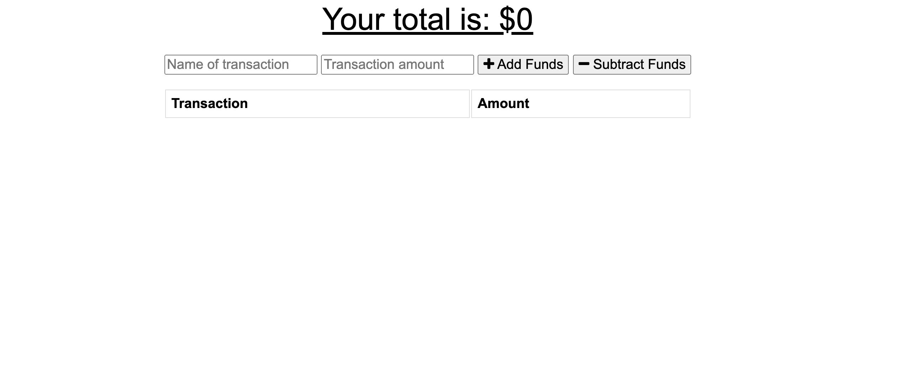
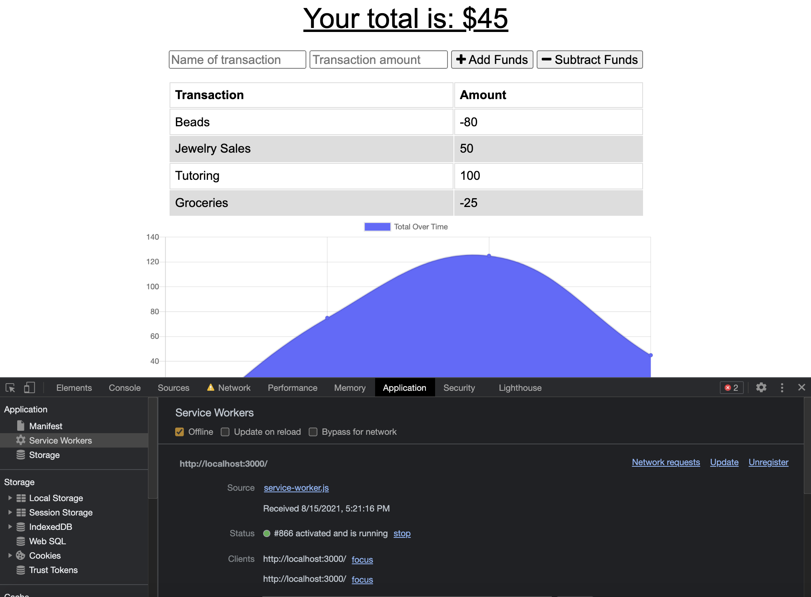
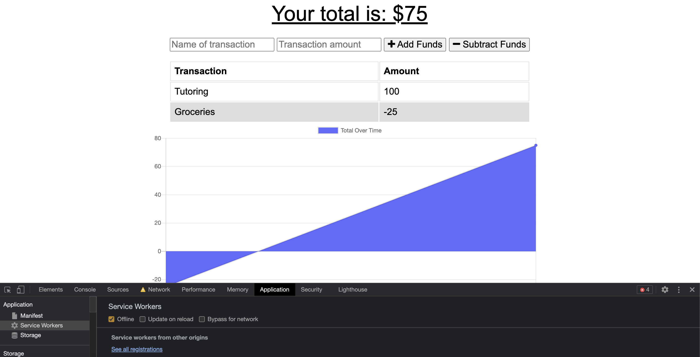

# Budget Tracker

### Table of Contents
- [Description](#Description)
- [License](#license)
- [Technologies Used](#Technologies-Used)
- [How to Use](#how-to-use)
- [Screenshots](#screenshots)
- [Links](#links)
- [Contributors](#contributors)
- [Questions](#questions)

## Description
This is an application that allows the user to update their budget when they are online or offline. If they are offline, they can still track their budget and when they are back online, it'll sync. The frontend was provided.

## License
[](https://opensource.org/licenses/MIT)

## Technologies Used
```
HTML JavaScript

CSS (Provided to me)

Node.JS
MongoDB
Express.JS
Mongoose

Service-workers
IndexedDB
Manifest
```

## How to Use
This application is simple to use. The user can enter the category of the expense. They can then add the amount. After that, they can select to either add or subtract that amount. The chart will update.

## Screenshots
This is the main page before information is added. 
This is the page that shows the app is offline and items are still added.



This is another view of the application working and it's offline.


## Links
Here is the link to the deployed application
[Budget Tracker](https://enigmatic-woodland-01661.herokuapp.com/)

## Contributors
- Stephanie Davis

## Questions
If you have any questions, please feel free to contact me. 
- GitHub: [whatawhat](www.github.com/whatawhat) to visit my repository
- Email: stephedavis12@gmail.com

